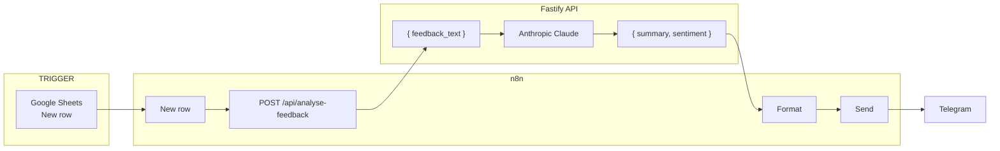

# Feedback Automation Workflow

When a new row is added to a Google Sheet, the system summarises the feedback with AI, classifies sentiment, and posts the result to Telegram.

**Flow:** Google Sheet (new row) → n8n → Fastify API → Telegram

---

## Diagram




---

## How it works

| Step | Who              | What                                                                                  |
| ---- | ---------------- | ------------------------------------------------------------------------------------- |
| 1    | **Google Sheet** | New row = one feedback entry.                                                         |
| 2    | **n8n**          | Detects new row, sends feedback text to the API.                                      |
| 3    | **Fastify API**  | Receives text, calls Anthropic Claude (summarise + sentiment, English), returns JSON. |
| 4    | **n8n**          | Gets summary + sentiment, formats and posts to Telegram.                              |

### API contract

- **Endpoint:** `POST /api/analyse-feedback`
- **Body:** `{ "feedback_text": "..." }`
- **Response:** `{ "summary": "...", "sentiment": "positive" | "neutral" | "negative" }`

---

## Data flow (summary)

1. New row in Google Sheet → n8n runs.
2. n8n POSTs `feedback_text` to Fastify.
3. Fastify uses Anthropic Claude → returns `summary` and `sentiment` (English).
4. n8n posts the formatted result to the Telegram channel.

---

## Technical (Fastify API)

This section describes the **Fastify API** in this repo: stack, structure, config, and behaviour.

### Stack & runtime

| Layer     | Technology                                                                                        |
| --------- | ------------------------------------------------------------------------------------------------- |
| Framework | Fastify 5                                                                                         |
| Language  | TypeScript (strict, ESM)                                                                          |
| Logging   | Pino (pretty in dev, JSON in production)                                                          |
| Plugins   | `@fastify/cors`, `@fastify/env`, `@fastify/rate-limit`, `@fastify/swagger`, `@fastify/swagger-ui` |
| AI        | Anthropic SDK (`@anthropic-ai/sdk`), Claude model                                                 |

Server entry: `src/index.ts` → `buildApp()` → `app.listen({ port, host })`. Port and host come from env (`PORT`, `HOST`). The app can be deployed on [Vercel](https://vercel.com/docs/frameworks/backend/fastify) with zero-config (entrypoint `src/index.ts` is auto-detected).

### Project structure

```
src/
  config/     Env schema and validation (@fastify/env), parseRateLimitConfig()
  models/     Request/response types and JSON schemas (feedback analysis)
  services/   analyseFeedbackService – Anthropic client, prompt, response parsing
  controllers/  analyseFeedbackController – validation, service call, error → HTTP
  routes/     analyseFeedback – POST /api/analyse-feedback registration + schema
  types/      Fastify augmentation (app.config typed as Env)
  app.ts      App factory: plugins, Swagger, rate limit, routes (/, /health, /unknown), 404 → redirect /unknown
  index.ts    Parse env (PORT, HOST), build app, listen
```

Flow for a request: **Route** (schema) → **Controller** (body check, call service, map errors) → **Service** (Anthropic, parse JSON).

### Configuration

Loaded and validated at startup via `@fastify/env` (schema in `src/config/env.ts`). Required: `ANTHROPIC_API_KEY`. Optional with defaults:

- `NODE_ENV`, `PORT`, `HOST`, `ANTHROPIC_MODEL`, `RATE_LIMIT_MAX`, `RATE_LIMIT_TIME_WINDOW_MS`

Config is available as `app.config` (typed as `Env`). Rate limit uses `parseRateLimitConfig(app.config)` to turn string env into `{ max, timeWindow }` for `@fastify/rate-limit`.

### Endpoints

| Method | Path                    | Description                                                                  |
| ------ | ----------------------- | ---------------------------------------------------------------------------- |
| GET    | `/`                     | Welcome page (HTML); confirms server is running; links to health and docs.   |
| GET    | `/health`               | Returns `{ "status": "ok" }`. No auth.                                       |
| GET    | `/documentation`        | Swagger UI (interactive API docs).                                           |
| GET    | `/unknown`              | Not-found page (404). Any unmatched URL redirects here.                      |
| POST   | `/api/analyse-feedback` | Body: `{ "feedback_text": "string" }`. Returns summary + sentiment or error. |

`POST /api/analyse-feedback` is protected by rate limiting (configurable max requests per time window). Request/response are validated with Fastify JSON schemas (see `src/models/feedback.ts` and route schema). Interactive API documentation is available at **`/documentation`** (Swagger UI); the OpenAPI spec is generated from the same route schemas.

### Analyse-feedback flow

1. **Route** – Validates body against `feedbackAnalysisRequestSchema` (required `feedback_text` string).
2. **Controller** – Rejects empty or whitespace-only `feedback_text` with `400` and `code: "EMPTY_FEEDBACK_TEXT"`.
3. **Service** – Calls Anthropic `messages.create()` with a system prompt that:
   - Accepts feedback in any language,
   - Asks for a short English summary and one of `positive` | `neutral` | `negative`.
   - Expects a single JSON object (no markdown).
4. **Response** – Parses the first text block, strips optional markdown fences, validates `summary` and `sentiment`, returns `{ summary, sentiment }` with `200`.

Errors from the service are mapped in the controller:

- `AnalyseFeedbackServiceError` with `code: "ANTHROPIC_ERROR"` → `502`, `code: "AI_SERVICE_ERROR"` (real cause logged).
- `AnalyseFeedbackServiceError` with `code: "INVALID_RESPONSE"` → `502`, `code: "AI_RESPONSE_ERROR"`.
- Any other thrown error → `500`, `code: "INTERNAL_ERROR"`.

Rate limit exceeded → `429` (from `@fastify/rate-limit`).

### AI integration

- **Provider:** Anthropic.
- **Model:** From env `ANTHROPIC_MODEL` (default `claude-sonnet-4-6`).
- **Behaviour:** Summary and sentiment are always requested and returned in **English**; the system prompt instructs the model to treat non-English feedback as “translate then analyse” so the API contract is language-agnostic.
- **Output:** One JSON object `{ "summary": "...", "sentiment": "positive"|"neutral"|"negative" }`; invalid or non-JSON responses are treated as `INVALID_RESPONSE` and return `502`.
